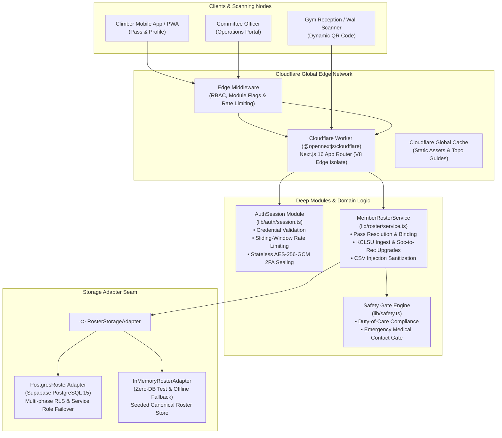

# King's College London Mountaineering Club (KCLMC) Platform

[](https://nextjs.org/)
[](https://www.typescriptlang.org/)
[](https://workers.cloudflare.com/)
[](https://supabase.com/)
[-6E9F18?style=flat&logo=vitest)](https://vitest.dev/)
[](tests/security.test.ts)
[](docs/LEGAL_COMPLIANCE_AND_RISK_AUDIT.md)

The official digital infrastructure, member pass engine, and operations platform for the **King's College London Mountaineering & Climbing Club (KCLMC)** (accredited society of King's College London Students' Union, Registered Charity No. 1136043) and the **London Universities Bouldering Event (LUBE)** multi-university league.

**Author & Lead Engineer**: [Remy Preston](https://github.com/RemTypes)  
**Live Production**: [kclmc.org](https://kclmc.org) • **Edge Preview**: [cloudflare-preview.kclmc.org](https://cloudflare-preview.kclmc.org)  
**Architecture Document**: [docs/ARCHITECTURE.md](docs/ARCHITECTURE.md) • **Domain Model**: [GLOSSARY.md](GLOSSARY.md)

---

## System Architecture



---

## Engineering Highlights & Key Architectural Decisions

### 1. Edge-First Deployment via Cloudflare OpenNext
Deployed to **Cloudflare Workers** using [`@opennextjs/cloudflare`](https://opennext.js.org/cloudflare). Server-side rendering (SSR), API route handlers, and middleware execute in lightweight, globally distributed V8 edge isolates with sub-10ms response times, offloading static assets to Cloudflare's edge cache.

### 2. Deep-Module Architecture
Constructed following deep-module engineering principles—maximizing leverage by offering simple, expressive interfaces that conceal substantial operational complexity:
- **[`MemberRosterService`](lib/roster/service.ts)**: A single module orchestrating multi-phase database lookups, cross-table student ID bindings, automated "Social-to-Recreational" upgrade state resolution, CSV formula injection defense, and dual-client RLS failovers behind a clean 5-method public interface.
- **[`AuthSession`](lib/auth/session.ts)**: A unified authentication module encapsulating sliding-window rate limiting, exponential backoff, CAPTCHA threshold triggers, mandatory committee 2FA checks, and cookie lifecycle management.

### 3. Storage Adapter Seams for Zero-Downtime Offline Resilience
Persistence is decoupled behind the [`RosterStorageAdapter`](lib/roster/service.ts) interface ([ADR 0002](docs/adr/0002-storage-adapter-seam-for-roster.md)):
- **`PostgresRosterAdapter`**: Production adapter executing parameterized queries against Supabase PostgreSQL with automated fallback to admin service-role clients when Row Level Security (RLS) policies require privileged verification.
- **`InMemoryRosterAdapter`**: Test-isolated, zero-dependency in-memory adapter backed by canonical seed data. Powers both offline climbing wall scan verification and the entire 202-test automated suite without network calls or database mocks.

### 4. Stateless AES-256-GCM 2FA Challenges Across Edge Isolates
To eliminate the database connection overhead and cross-region latency of ephemeral login states on Cloudflare Workers, pending two-factor authentication challenges are encrypted using **AES-256-GCM** authenticated tags and stored in a short-lived (5-minute TTL), `httpOnly`, `SameSite=Strict`, `Secure` cookie ([ADR 0001](docs/adr/0001-stateless-aes-gcm-2fa-challenges.md)). Any edge node can decrypt and verify the second factor without touching the database.

### 5. Zero-Trust Duty-of-Care Safety Gate
In mountaineering, safety compliance is a legal necessity. The platform features an automated **Safety Gate** ([`lib/safety.ts`](lib/safety.ts)) enforcing UK climbing wall duty-of-care: a member's digital climbing pass remains locked and scanners flag it as incomplete until verified mobile numbers and emergency contact details are provided.

### 6. Defense-in-Depth Security Suite (OWASP Top 10)
Backed by an automated 86-test security testing suite ([`tests/security.test.ts`](tests/security.test.ts)):
- **Brute-Force & Lockout**: Dual-keyed sliding-window rate limiter (IP + email) with exponential backoff after 3 failed attempts, dynamic CAPTCHA challenge requirements, and 15-minute account lockout after 5 failures.
- **Timing Attack Resistance**: Cryptographic comparisons for OTP tokens, backup codes, and signatures utilize constant-time `crypto.timingSafeEqual`.
- **CSV Formula Injection Mitigation**: Sanitizes untrusted spreadsheet cells starting with `=`, `+`, `-`, or `@` during sales reconciliation exports.
- **SQL & Parameter Tampering**: Parameterized queries via PostgREST and strict regex bounds on student IDs (`^[A-Z0-9_-]{3,32}$`).

### 7. Machine Learning Pipeline for Club Stash Pre-Orders
Located in [`ml/`](ml/):
- **Demand Elasticity Modeling (`ml/01_demand_elasticity.py`)**: Estimates price elasticity ($\epsilon$) across historical apparel sales to forecast pre-order volumes and break-even Minimum Order Quantity (MOQ) thresholds.
- **Sizing Distribution Optimization (`ml/02_sizing_optimization.py`)**: Uses historical apparel sizing and university demographic distributions to calculate optimal garment size ratios (XS–XXL), reducing overstock waste.

---

## Tech Stack

| Layer | Technology | Purpose |
| :--- | :--- | :--- |
| **Framework** | [Next.js 16 (App Router)](https://nextjs.org/) + [React 19](https://react.dev/) | Server Components, Streaming SSR, and dynamic route handlers |
| **Language** | [TypeScript](https://www.typescriptlang.org/) | Strict mode type safety across entire domain and data models |
| **Edge Runtime** | [Cloudflare Workers](https://workers.cloudflare.com/) + [`@opennextjs/cloudflare`](https://opennext.js.org/cloudflare) | Sub-10ms global edge compute with static asset offloading |
| **Database & Auth** | [Supabase](https://supabase.com/) (PostgreSQL 15) | Row Level Security (RLS), GoTrue Auth, and SSR cookie sessions |
| **Styling & UI** | [Tailwind CSS v3](https://tailwindcss.com/) + [Lucide Icons](https://lucide.dev/) | Custom Alpine Forest (`#052322`) and Summit Gold (`#FFBD59`) theme |
| **Animation** | [Framer Motion](https://www.framer.com/motion/) | Pass rendering, accordion states, and transitions |
| **Testing** | [Vitest](https://vitest.dev/) | Unit, integration, and security vulnerability test suites |
| **Analytics & ML** | [Python 3.11](https://www.python.org/) + `scipy` / `numpy` | Merch demand elasticity and sizing distribution models |
| **Email Gateway** | SMTP via [Purelymail](https://purelymail.com/) | British Mountaineering Council (BMC) insurance dispatches |

---

## Key Modules & Codebase Directory Map

```text
kclmc-portal/
├── app/                              # Next.js 16 App Router Routes
│   ├── (auth)/                       # Unified authentication, 2FA & password reset
│   ├── (kclmc)/                      # Public club pages, guides, meets & stash
│   ├── (lube)/                       # London University Bouldering Event (LUBE) league
│   ├── admin/                        # Committee Management Suite (RBAC >= 1)
│   │   ├── bmc/                      # BMC insurance mail-merge & dispatch tracking
│   │   ├── content/                  # CMS for crags, gyms, meets & products
│   │   ├── ml/                       # Stash demand elasticity & sizing forecasts
│   │   ├── reconcile/                # KCLSU CSV roster reconciliation engine
│   │   └── scan/                     # Wall receptionist QR pass camera scanner
│   └── api/                          # High-throughput API Route Handlers
│       ├── auth/                     # Login, signup, 2FA, OTP & session endpoints
│       ├── membership/               # Pass resolution & duty-of-care safety updates
│       ├── roster/                   # Committee member directory & CSV sync
│       ├── roster/link/              # Student ID claiming & union validation
│       └── verify/[membershipId]/    # Public wall scanner pass verification
├── lib/
│   ├── auth/session.ts               # Deep AuthSession & 2FA Challenge module
│   ├── roster/service.ts             # Deep MemberRosterService & storage adapter seams
│   ├── security/                     # Rate limiting, password policy, cookies & 2FA
│   ├── bmc_insurance.ts              # BMC liability insurance & mail-merge parsing
│   └── safety.ts                     # Duty-of-care completeness gatekeeper
├── docs/
│   ├── ARCHITECTURE.md               # Detailed system architecture & design document
│   ├── COMMITTEE_HANDOVER_MANUAL.md  # Complete 400+ line operations manual
│   ├── LEGAL_COMPLIANCE_AND_RISK_AUDIT.md # UK GDPR & statutory compliance audit
│   └── adr/                          # Architectural Decision Records (ADRs)
├── ml/                               # Demand elasticity & garment sizing optimization
└── tests/                            # Automated test suites (202 tests)
```

---

## Quality Assurance & Automated Testing

The platform enforces strict test-driven reliability with **13 test suites** and **202 passing automated tests**:

```bash
# Run entire test suite (unit, integration & security)
npm test

# Run dedicated OWASP security audit suite (86 tests)
npm run test:security
```

```text
 ✓ tests/auth_session.test.ts (9 tests)
 ✓ tests/member_roster.test.ts (8 tests)
 ✓ tests/security.test.ts (86 tests)
 ✓ tests/roster.test.ts (12 tests)
 ✓ tests/roster_link.test.ts (4 tests)
 ✓ tests/verify_pass.test.ts (5 tests)
 ✓ tests/safety_gate.test.ts (5 tests)
 ✓ tests/signup_to_paid_flow.test.ts (4 tests)
 ✓ tests/password_reset.test.ts (4 tests)
 ✓ tests/university_auth.test.ts (6 tests)
 ✓ tests/whatsapp_gateway.test.ts (4 tests)
 ✓ tests/bmc_insurance.test.ts (4 tests)
 ✓ tests/release_checklist.test.ts (51 tests)

 Test Files  13 passed (13)
      Tests  202 passed (202)
   Duration  890ms
```

---

## Getting Started & Local Development

### Prerequisites
- Node.js 20+ (LTS)
- npm 10+

### Setup

```bash
# 1. Clone repository
git clone https://github.com/RemTypes/kclmc-portal.git
cd kclmc-portal

# 2. Install dependencies
npm install

# 3. Configure environment variables (optional for local mock mode)
cp sample.env .env.local

# 4. Start local development server
npm run dev
```

Visit [http://localhost:3000](http://localhost:3000) to view the portal. The application includes a self-contained in-memory fallback layer, allowing full browsing, climbing pass resolution, and testing without requiring a live Supabase connection.

### Production Edge Build

```bash
# Build Cloudflare OpenNext worker bundle
npm run build:worker

# Deploy to Cloudflare Workers (via Wrangler)
npm run deploy:cloudflare
```

---

## Documentation Index

- **[System Architecture & Design Document](docs/ARCHITECTURE.md)**: Deep dive into module interfaces, data flow, security, and edge mechanics.
- **[Domain Model & Terminology (GLOSSARY.md)](GLOSSARY.md)**: Ubiquitous language dictionary for society concepts.
- **[Committee Operations & Handover Manual](docs/COMMITTEE_HANDOVER_MANUAL.md)**: Comprehensive tenure transition guide, database schemas, and workflows.
- **[Legal Compliance & Risk Audit](docs/LEGAL_COMPLIANCE_AND_RISK_AUDIT.md)**: UK GDPR Art. 32, ICO fee exemptions, and BMC liability notices.
- **[ADR 0001: Stateless AES-GCM 2FA Challenges](docs/adr/0001-stateless-aes-gcm-2fa-challenges.md)**: Architectural rationale for edge multi-isolate 2FA.
- **[ADR 0002: Storage Adapter Seam for Roster](docs/adr/0002-storage-adapter-seam-for-roster.md)**: Architectural rationale for pluggable persistence.

---

## Author

**Remy Preston**  
*Lead Architect & Full-Stack Engineer*  
- **GitHub**: [@RemTypes](https://github.com/RemTypes)  
- **Email**: [remy.preston@outlook.com](mailto:remy.preston@outlook.com) / [remy.preston@kcl.ac.uk](mailto:remy.preston@kcl.ac.uk)  

---

## License

This project is licensed under the [MIT License](LICENSE).
