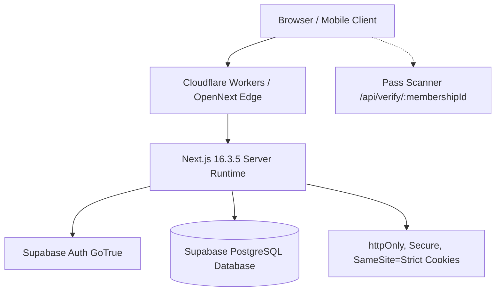

# KCLMC Platform: Comprehensive Session Handover & Architecture Guide

> **Current Timestamp**: October 2026  
> **Repository Directory**: `/Users/rem/Documents/Rem-Vault/KCLMC/kclmc-platform`  
> **Current Git Commit**: `1382979` (Working tree clean across all branches & remotes)  
> **Test Status**: **120 / 120 passing** (`npm test`) | **0 TypeScript errors** (`npx tsc --noEmit`)  
> **Production Edge Bundle**: Built and verified (`npm run build:worker` -> `.open-next/worker.js`)  

---

## 1. Executive Summary & Project Purpose

The **KCLMC Platform** is the official digital infrastructure for the **King's College London Mountaineering & Climbing Club (KCLMC)**, an accredited student society of King's College London Students' Union (KCLSU, Registered Charity No. 1136043).

### Core Features & Modules
1. **Digital Climbing Membership Pass (`/membership`)**:
   - Allows verified students to link their KCL Student ID (e.g. `K23158797`) and display their official digital climbing pass.
   - Matches against the official `kclsu_roster` database (Social vs. Recreational membership tiers).
   - Manages climber safety profiles, emergency contact details, and dietary/medical notes.
2. **Where We Climb (`/guides`)**:
   - Comprehensive guide directory for London indoor climbing centres (Mile End, Castle, Parthian, VauxWall, Bermondsey Wall, HarroWall) with exclusive KCL student discount information and nearby outdoor crags.
3. **Apparel Drops & Stash (`/drops/kclmc`)**:
   - Group-buy merchandise pre-order system with live MOQ (Minimum Order Quantity) tracking.
4. **Trips & Meets (`/trips`)**:
   - Upcoming mountaineering, trad, and winter climbing trip calendar (Peak District, Harrison's Rocks, Portland, Font, Highlands).
5. **Committee Administration Portal (`/admin`)**:
   - **Payment Reconciliation (`/admin/reconcile`)**: 3-tier CSV reconciliation engine matching KCLSU payment reports against membership and merchandise orders.
   - **Pass Scanner (`/admin/scan`)**: Mobile QR and barcode scanner for committee check-ins at climbing walls.
   - **CMS Content Manager (`/admin/content`)**: Manage trips, guides, and merch.
   - **Manufacturer Export (`/admin/export`)**: Sizing matrix generator for garment printers.
   - **Modules & Permissions (`/admin/modules`)**: Dynamic route access and feature flags.

---

## 2. Technology Stack & Deployment Architecture



- **Framework**: Next.js 16.3.5 (App Router, webpack build).
- **Edge Deployment**: Cloudflare Workers using OpenNext (`@opennextjs/cloudflare` v1.20.6, `workerd` compatibility date `2026-06-12`).
- **Database & Auth**: Supabase PostgreSQL with `@supabase/ssr` v0.12.7 and `@supabase/supabase-js` v2.117.0.
- **Styling**: Tailwind CSS 3.4.19, custom topo pattern textures, brand fonts (Barlow Condensed, Inter, Space Mono).
- **Brand Palette**:
  - Alpine Forest Teal: `#052322` (primary background), `#041F1E` (surface dark), `#084746` (borders & cards).
  - Summit Gold: `#FFBD59` (primary accents, links, buttons, active states).
- **Official Crest**: Circular dark green emblem with white "KCL MC" text and climber hanging from 'K' (`public/images/kclmc-logo.png`). Note: "Est. 1928" was removed across the codebase as it was an unverified template placeholder.

---

## 3. Git Topology & Remotes

The project is hosted across two GitHub remotes and must always be kept synchronized:

```text
origin: https://github.com/RemTypes/kclmc-platform.git
portal: https://github.com/RemTypes/kclmc-portal.git
```

### Active Branches (All synchronized at commit `1382979`):
- `main`: Canonical production codebase.
- `cloudflare-preview`: Deployed Cloudflare preview environment.
- `portal-clean`: Tracking branch for `portal/main`.

### Sync Command Pattern:
```bash
git checkout main
git add -A && git commit -m "your message"
git push origin main
git checkout cloudflare-preview && git reset --hard main && git push origin cloudflare-preview --force && git push portal cloudflare-preview --force
git checkout portal-clean && git reset --hard main && git push portal portal-clean:main --force
git checkout main
```

---

## 4. Key Architectural Implementations & Security Hardening

### A. 5 Security Vulnerabilities Patched
1. **`httpOnly` Session Token Isolation**:
   - Session tokens are strictly stored in `httpOnly: true, secure: true, sameSite: 'strict'` cookies to eliminate XSS risks (`lib/security/cookies.ts`).
   - Browser client JS cannot inspect cookies. All authenticated client requests call `/api/auth/me` or `/api/membership`.
2. **Server-Side Admin Role Enforcement**:
   - `middleware.ts` enforces `role >= 1` for `/admin` pages and `/api/reconcile`, `/api/roster`, and `GET /api/telemetry`.
   - `getAuthenticatedUserRole(supabase, user)` in `lib/auth.ts` validates the user against both committee email whitelists and the Supabase `profiles` table.
3. **Two-Factor Authentication (2FA/OTP)**:
   - Mandatory for committee accounts (`role >= 1`).
   - RFC 6238 TOTP authenticator app support (QR code setup on first committee login).
   - 8 single-use 8-character backup codes (`XXXX-XXXX`) with burn-on-use.
   - Sealed stateless challenges (`lib/security/two-factor.ts`) using AES-256-GCM so login challenges survive across Cloudflare edge worker isolates.
   - Enrolled secrets and hashed backup codes stored in `auth.users.raw_user_meta_data`.
4. **Rate Limiting, Lockout & CAPTCHA**:
   - `lib/security/rate-limiter.ts`: Max 5 failed attempts per 15 minutes by IP or account.
   - Account lockout with exponential backoff on 5+ failures.
   - CAPTCHA challenge triggered after 3 failures.
   - Security audit logging for SIEM monitoring.
5. **Strict Password Policy**:
   - Enforced in `lib/security/password-policy.ts`: Min 12 characters, uppercase, lowercase, numbers, symbols, and rejection of the top 10k common passwords.

### B. Database RLS Hardening (`supabase/migrations/006_harden_roster_rls.sql`)
- Revoked unrestricted public `select` on `kclsu_roster`.
- Direct table SELECT is restricted to `user_id = auth.uid()` and `get_user_role() >= 1`.
- Public wall scanners query the dedicated RPC function `verify_membership_card(card_num)` which returns strictly `{ is_valid, full_name, tier, academic_year }` without leaking transaction IDs or student data.

### C. HTTP Security Headers (`next.config.mjs`)
- Configured:
  - `X-Frame-Options: DENY`
  - `X-Content-Type-Options: nosniff`
  - `Referrer-Policy: strict-origin-when-cross-origin`
  - `Permissions-Policy: camera=(), microphone=(), geolocation=()`
  - `Strict-Transport-Security: max-age=31536000; includeSubDomains; preload`

### D. Dynamic Browser Tab Titles & SEO Metadata
- Base template in `app/layout.tsx`: `title: { default: "KCLMC | Mountaineering & Climbing", template: "%s | KCLMC" }`.
- Route layouts export section titles (`Digital Membership Pass`, `Where We Climb`, `Trips & Meets Calendar`, `Club Merch`, `Sign In`, `Committee Admin Portal`, `Pass Scanner`, etc.).
- `app/(kclmc)/membership/page.tsx` dynamically sets `document.title` to the member's name upon login: `Alice Richardson | Pass | KCLMC`.

### E. Mobile Navigation & Resilience
- `components/Navigation.tsx` includes a mobile hamburger toggle and slide-down drawer.
- Branded error pages: `app/not-found.tsx` (404) and `app/error.tsx` (global error boundary).
- Multi-resolution favicons and App Router icons (`app/icon.png`, `app/apple-icon.png`, `public/favicon.ico`).

---

## 5. Critical Engineering Rules & Gotchas

> [!CAUTION]
> **1. macOS iCloud Drive Conflict Files**:
> When editing files on macOS iCloud Drive, syncing can occasionally generate duplicate conflict files named `* 2.*` or `* 3.*` (e.g. `layout 2.tsx` or `cache-life.d 2.ts`). These cause TypeScript compiler duplicate identifier errors.
> **Fix**: Run:
> ```bash
> find . \( -name "* 2.*" -o -name "* 3.*" \) -delete
> ```

> [!IMPORTANT]
> **2. `httpOnly` Cookies vs Client-Side Supabase SDK**:
> `@supabase/ssr` default configuration uses `httpOnly: false`. However, we have hardened all session cookies to `httpOnly: true`. Therefore:
> - Client components (`'use client'`) CANNOT read session tokens via `document.cookie` or `createBrowserClient().auth.getUser()`.
> - Always route authenticated data reads/writes through Next.js server route handlers (`/api/auth/me`, `/api/membership`), which receive the cookie automatically in the request header.

> [!WARNING]
> **3. Client Components & Metadata**:
> In Next.js App Router, files with `'use client'` cannot export `metadata`. To set tab titles and SEO for client pages:
> - Create a companion `layout.tsx` in that route's folder (e.g. `app/(kclmc)/membership/layout.tsx`) that exports `metadata = { title: '...' }`.
> - For runtime updates (e.g. member name), update `document.title` inside `useEffect` or data callbacks.

> [!NOTE]
> **4. Cloudflare Worker Environment Variables**:
> `wrangler.jsonc` defines build-time variables (`NEXT_PUBLIC_SUPABASE_URL`, `NEXT_PUBLIC_SUPABASE_ANON_KEY`, `SUPERADMIN_EMAIL`, `COMMITTEE_EMAILS`).
> `SUPABASE_SERVICE_ROLE_KEY` MUST be configured as an encrypted secret in Cloudflare Dashboard:
> ```bash
> npx wrangler secret put SUPABASE_SERVICE_ROLE_KEY
> ```

---

## 6. Pre-Publish Dashboard Verification Checklist

Before taking the site live publicly, verify these settings in the Supabase & Cloudflare dashboards:

1. **Supabase SQL Editor**:
   - Execute [`supabase/migrations/006_harden_roster_rls.sql`](file:///Users/rem/Documents/Rem-Vault/KCLMC/kclmc-platform/supabase/migrations/006_harden_roster_rls.sql) in the Supabase SQL editor to ensure live table RLS restricts public SELECT on `kclsu_roster`.
2. **Supabase URL Configuration**:
   - In **Authentication** $\rightarrow$ **URL Configuration**:
     - Set **Site URL** to `https://kclmc.org` (or production domain).
     - Add `https://<your-domain>/auth/callback**` to **Redirect URLs**.
3. **Supabase SMTP Settings**:
   - In **Authentication** $\rightarrow$ **SMTP Settings**, configure custom SMTP (Purelymail / Resend) to avoid the 3 emails/hour rate limit on Supabase free tier.
4. **Cloudflare Worker Secrets**:
   - Verify `SUPABASE_SERVICE_ROLE_KEY` exists in Cloudflare Worker secrets.

---

## 7. Useful Commands Reference

```bash
# Run unit & security test suite (120 tests)
npm test

# Run TypeScript type check
npx tsc --noEmit

# Run Next.js production build
npm run build

# Build OpenNext Cloudflare Edge Worker
npm run build:worker

# Clean untracked iCloud conflict files
find . \( -name "* 2.*" -o -name "* 3.*" \) -delete

# Run database GDPR backup script
npm run backup
```

---

*This document serves as the authoritative handover. A new chat model can ingest this file to immediately continue development without missing any context.*
