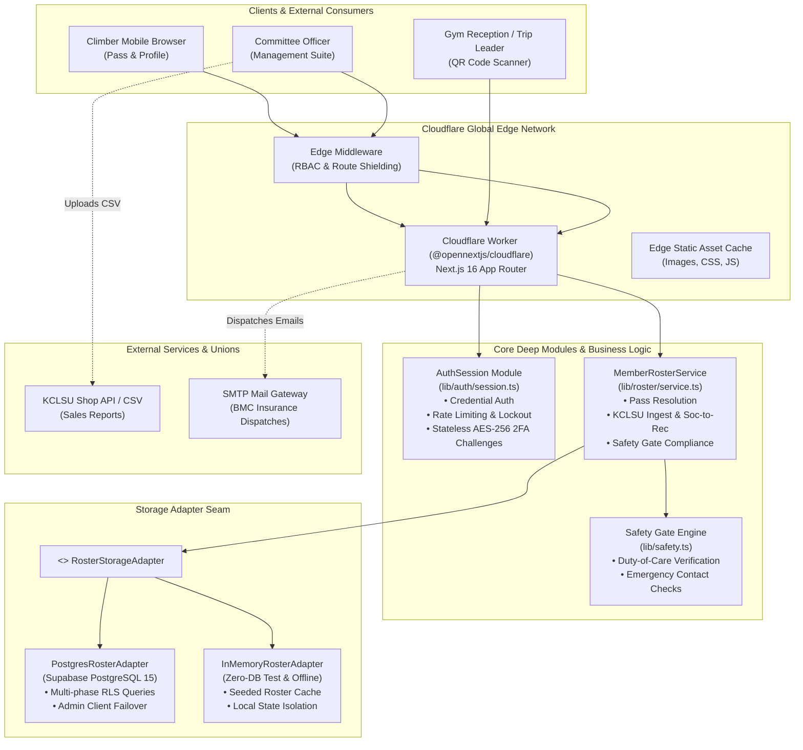
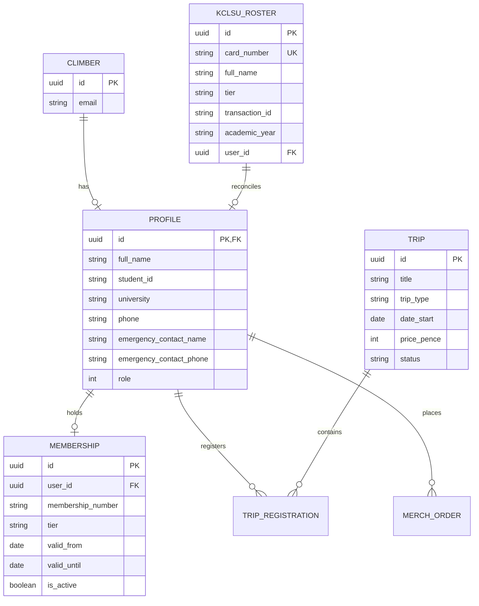

# KCLMC Platform: Architecture & System Design

**Author**: Remy Preston  
**Platform**: King's College London Mountaineering Club (KCLMC) & London Universities Bouldering Event (LUBE)  
**Deployment Target**: Cloudflare Workers via `@opennextjs/cloudflare`  
**Database**: PostgreSQL 15 (Supabase) with RLS + Offline In-Memory Fallback  

---

## 1. System Overview

The KCLMC Platform is an edge-first, high-resilience web application that serves as the central operations and compliance engine for King's College London's outdoor society and the intercollegiate London Universities Bouldering Event (LUBE) league.

The platform bridges university administration, safety duty-of-care, real-time climbing wall verification, and event scoring:

---

## 2. Core Architectural Principles

The platform follows clean software engineering principles:

### A. Deep Modules Over Shallow Abstractions
Rather than scattering business logic across thin utility functions or leaky controllers, functionality is consolidated into **deep modules** that provide high leverage through simple interfaces while concealing substantial implementation complexity:

1. **[`MemberRosterService`](../lib/roster/service.ts)**:
   - **Interface**: Exposes concise operations: `resolveMemberPass()`, `linkStudentId()`, `verifyPass()`, `updateSafetyNotes()`, and `syncRoster()`.
   - **Concealed Complexity**: Dual-phase database lookups, cross-table joins between union card numbers and Supabase auth profiles, "Social-to-Recreational" upgrade state resolution, CSV formula injection neutralization, and automated failover between user-session RLS clients and admin service-role clients.
2. **[`AuthSession`](../lib/auth/session.ts)**:
   - **Interface**: Exposes `authenticateCredentials()`, `verifyTwoFactor()`, and `toApiResponse()`.
   - **Concealed Complexity**: Sliding-window IP/email rate limiting, exponential backoff with account lockout, CAPTCHA threshold triggers, mandatory committee 2FA evaluation, RFC 6238 TOTP verification, single-use backup code burning, and stateless AES-256-GCM challenge token encryption.

### B. Storage Adapter Seams
To eliminate tight coupling to PostgreSQL and enable zero-mock, sub-second testing:
- **Interface**: [`RosterStorageAdapter`](../lib/roster/service.ts) defines storage operations for climber profiles, purchases, passes, and verification.
- **Implementations**:
  - `PostgresRosterAdapter`: Communicates with Supabase PostgreSQL with built-in RLS error resilience.
  - `InMemoryRosterAdapter`: Backed by an in-memory map and canonical seed data, enabling all 202 unit and security tests to run completely isolated without database dependencies or network latency.
- Documented in [ADR 0002: Storage Adapter Seam for Roster Reconciliation and Pass Verification](adr/0002-storage-adapter-seam-for-roster.md).

### C. Stateless Distributed 2FA Challenges
Cloudflare Workers run in ephemeral, globally distributed V8 isolates. Storing multi-step authentication state in database tables introduces latency and connection bloat:
- Ephemeral 2FA challenge state is sealed using **AES-256-GCM** encryption with authenticated tags.
- The challenge token is returned as an encrypted HTTP-only cookie (`kclmc_2fa_pending`) with a 5-minute time-to-live.
- Any Cloudflare edge node can verify the second factor without database round-trips.
- Documented in [ADR 0001: Stateless AES-GCM 2FA Challenges](adr/0001-stateless-aes-gcm-2fa-challenges.md).

---

## 3. Security & Compliance Architecture

The platform operates in a high-liability collegiate sports environment, necessitating defense-in-depth:

| Security Domain | Implementation | Defense Strategy |
| :--- | :--- | :--- |
| **Authentication & 2FA** | `lib/security/two-factor.ts` | Mandatory TOTP 2FA for all committee officers (Role ≥ 1); single-use 8-character hashed backup codes; 5-minute strict OTP expiry. |
| **Brute-Force & Credential Stuffing** | `lib/security/rate-limiter.ts` | Sliding-window tracker across IP and email; exponential backoff after 3 failures; full 15-minute account lockout after 5 failures; dynamic CAPTCHA challenge requirement. |
| **Timing Attacks** | `crypto.timingSafeEqual` | Constant-time buffer comparisons for all tokens, OTP codes, and backup hashes. |
| **CSV Formula Injection** | `lib/roster.ts` (`sanitizeCsvCell`) | Strips formula prefixes (`=`, `+`, `-`, `@`) when parsing or exporting membership files. |
| **XSS & Buffer Overflow** | Regex input validation | Strict bounds on all identifiers, names, emails, and student ID inputs (e.g. `^[A-Z0-9_-]{3,32}$`). |
| **Row Level Security (RLS)** | PostgreSQL Policies | Database-level enforcement restricting members to their own records and committee to authorized tables. |
| **Duty-of-Care Safety Gate** | `lib/safety.ts` | Digital climbing pass is gated until mobile number and emergency contacts are provided, satisfying UK climbing wall duty-of-care requirements. |

---

## 4. Domain Model

The platform domain is strictly specified in [`GLOSSARY.md`](../GLOSSARY.md):

---

## 5. Machine Learning Subsystem

Located in `ml/`:
1. **Demand Elasticity Modeling (`ml/01_demand_elasticity.py`)**: Estimates price elasticity of demand ($\epsilon$) across historical club merchandise drops (tees, hoodies, fleeces) to forecast pre-order volumes and break-even MOQ (Minimum Order Quantity) thresholds.
2. **Sizing Distribution Optimization (`ml/02_sizing_optimization.py`)**: Uses historical apparel sizing data and student demographic distributions to predict optimal garment size ratios (XS to XXL), reducing overstock waste and stockouts.

---

## 6. Testing Architecture

The test suite runs via [Vitest](https://vitest.dev/) with 100% offline isolation:

- **13 Test Suites / 202 Automated Tests**:
  - `tests/security.test.ts` (86 tests): Comprehensive vulnerability audit covering rate limiting, lockout, timing-attack resistance, password strength policies, and SQL/XSS bounds.
  - `tests/auth_session.test.ts`: Edge session lifecycle, 2FA challenge encryption, and cookie issuance.
  - `tests/member_roster.test.ts`: Pass resolution, linking collision prevention, and tier upgrade logic across the in-memory seam.
  - `tests/safety_gate.test.ts`: Duty-of-care profile completion gating.
  - `tests/verify_pass.test.ts`: Wall scanner pass validation and tamper detection.
  - `tests/roster_link.test.ts`: Student ID reconciliation against official union purchases.
  - `tests/bmc_insurance.test.ts`: Insurance mail-merge generation and deduplication.
